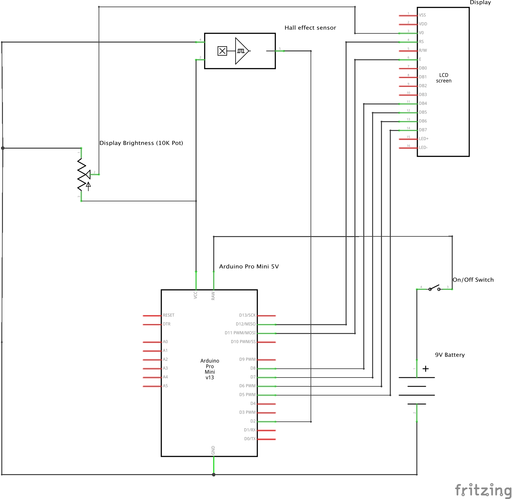

# ArduinoTachometer
Simple Arduino tachometer using Hall effect sensor.

This is a basic Tachometer, it uses a Hall effect sensor to detect a magnet
on the shaft of the device you are measuring the speed of. Output is to a 
LCD screen in RPM. The screen brightness can be adjusted with the potentiometer.

## Parts

- Arduino Pro Mini (5V)
- 16x2 LCD display (Hitachi HD44780 type)
- 10k Potentiometer
- Hall effect sensor
- on/off switch
- 9V battery clip
- Battery/wires etc

## Wiring

Wiring for the LCD display is per the Arduino tutorial as referenced in the code. Some of the
pins have been changed as they used pin 2 originally which we require for the Hall effect sensor
change interrupt.

## Installation

Code is compiled and installed the normall way with the Arduino dev environment. 

## Use

Attach a (small) magnet to the shaft of the device you want to measure. Arrange for the Hall
effect sensor to be close to the magnet as it goes past.
